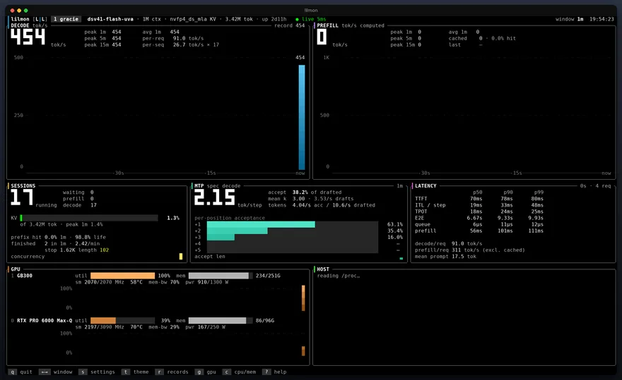
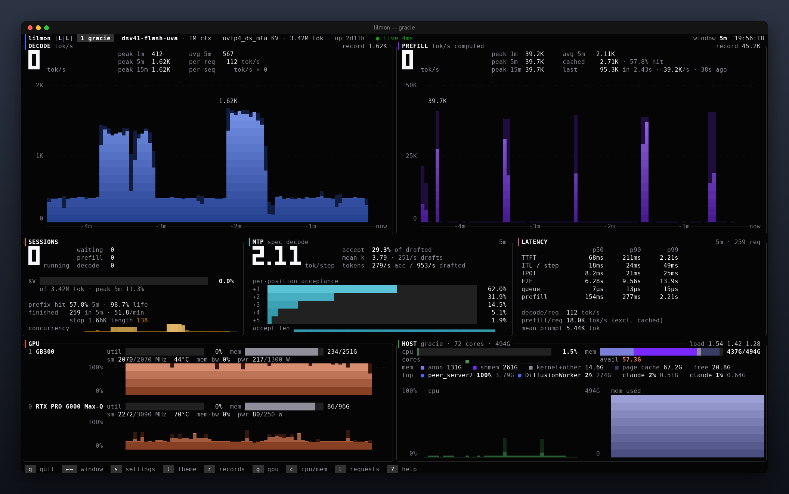
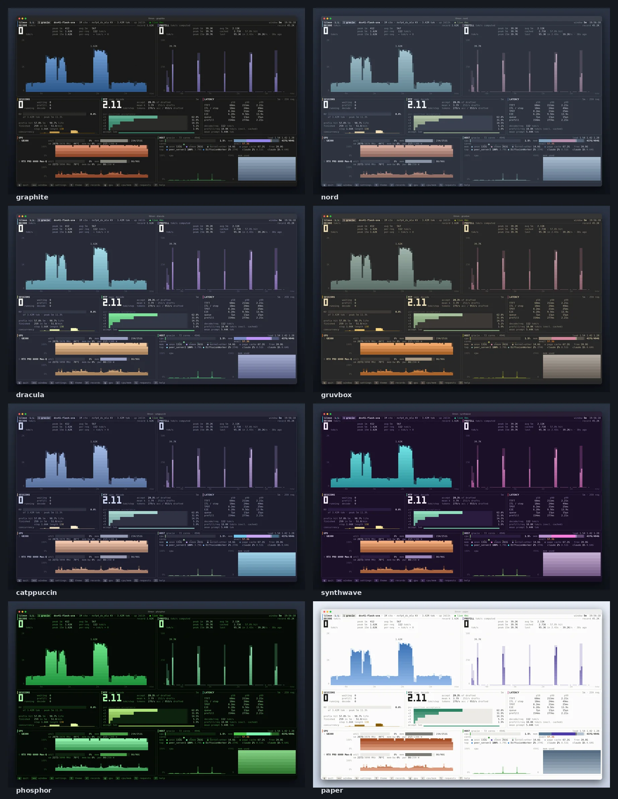
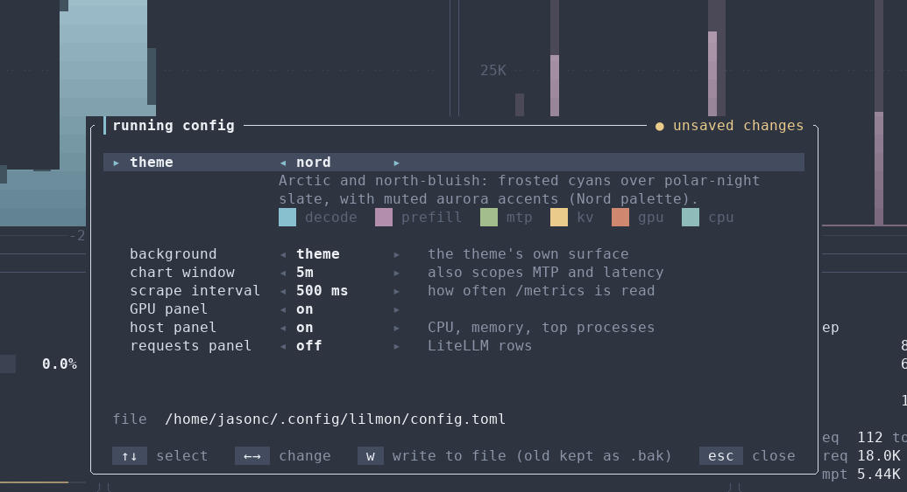

<div align="center">

<h1>lilmon <code>[L|L]</code></h1>

<p><b>The Local Inference Lab monitor</b><br>
A fast, good-looking terminal dashboard for <a href="https://github.com/vllm-project/vllm">vLLM</a> servers.</p>

<p>
<a href="https://local-inference-lab.ai"></a>
<a href="https://discord.gg/localinferencelab"></a>
<a href="LICENSE"></a>

</p>



<sub>Live capture from a production vLLM server under mixed load, sped up 8×.</sub>

</div>

## Why lilmon

- **Prefill numbers you can trust.** vLLM only credits prompt tokens when a request's first token comes
  out, so naive dashboards turn one long prefill into a single absurd spike. lilmon spreads each prefill
  back over its time to first token, giving the real tokens/second.
- **Speculative decoding, explained.** Accept length, accept rate and a per-position acceptance funnel.
  It stays exact even when the draft length changes with batch size.
- **The whole box on one screen.**
  - Decode and prefill rates with 1/5/15-minute peaks.
  - Sessions and KV cache.
  - Latency percentiles.
  - GPU telemetry (NVML) and host CPU, memory and top processes.
  - Optional per-request rows from LiteLLM.
- **Featherweight and hands-off.** A single ~4 MB Rust binary that uses about 0.6% of one core. It only
  ever sends GET requests to endpoints vLLM already exposes.
- **Yours to style.** 14 themes (the default, `lil`, uses the Local Inference Lab brand colors), a
  background that works on transparent terminals, and live settings you can save back to the config file.

## Install

```sh
cargo install --git https://github.com/local-inference-lab/lilmon
```

Or build from a clone:

```sh
git clone https://github.com/local-inference-lab/lilmon
cd lilmon && cargo build --release    # binary: target/release/lilmon
```

lilmon needs Rust 1.88 or newer and runs on Linux. The GPU panel uses the NVIDIA driver's NVML library
when it's present; without it, the panel hides itself.

## Quick start

```sh
lilmon                          # endpoints from ~/.config/lilmon/config.toml (created on first run)
lilmon localhost:8000           # ad-hoc endpoint(s): host:port or a full /metrics URL
lilmon 8001                     # a bare port means localhost
VLLM_API_KEY=sk-... lilmon      # servers started with --api-key
lilmon 8000 --litellm litellm.example.com   # add recent requests from a LiteLLM proxy
lilmon --theme nord --bg none   # try a theme and keep the terminal's transparency
lilmon --list-themes            # every theme with swatches and a description
```

Press `?` inside lilmon for help, `s` for settings, and `t` to flip through themes.

## Screenshots

<p align="center">

</p>

<details open>
<summary><b>Themes</b>: 8 of the 14 shown (the default <code>lil</code> theme is the animation and dashboard above)</summary>
<p align="center"></p>
</details>

<details>
<summary><b>Live settings (the running config)</b></summary>
<p align="center"></p>
</details>

## Panels

- **Decode / Prefill tok/s.** Shows the current rate in big digits and the peak 1-second rate over three
  trailing windows (default 1, 5 and 15 minutes). The chart's window is selectable. When one column covers
  several seconds, the mean is solid and the span up to the max is drawn dimmer. Prefill counts computed
  tokens only; prefix-cache hits are shown separately as "cached".
- **Sessions.** Running and waiting requests, split into prefill and decode. Also KV cache usage against
  capacity, prefix-hit rate, finish reasons, preemptions and a concurrency sparkline.
- **MTP / spec decode.** Accept length (tokens per verify step), accept rate, mean k, draft and accept
  rates, a per-position acceptance funnel, and accept length over time.
- **Latency.** p50/p90/p99 for TTFT, ITL (per step), TPOT, E2E, queue and prefill time over the window,
  from histogram deltas. Also per-request decode and prefill speed and the mean prompt size.
- **GPU.** Read from local NVML: util, HBM, SM clock, temperature, memory-bandwidth util, power draw
  against the enforced limit, and util history.
- **Host.** Read from local /proc:
  - CPU: busy %, iowait, a per-core strip, load average and CPU history.
  - Memory: used of total, and composition. anon is process memory; shmem is shared memory such as pinned
    or registered tables; kernel+other; page cache is the reclaimable part. Free and available, plus
    memory history.
  - Busiest processes: CPU (% of one core) and RSS. vLLM processes are marked ●.
- **Requests.** Recent per-request rows from LiteLLM's spend log: client, prompt size, output tokens,
  TTFT, decode tok/s, duration. This covers LiteLLM-routed traffic only, and rows land up to ~60 s late.

GPU and host panels describe the machine lilmon runs on.

## Keys

| key | action |
|---|---|
| `←` `→` / `[` `]` | chart window: 1m 5m 15m 1h 6h 24h (also scopes MTP and latency) |
| `tab` / `1`–`9` | switch endpoint |
| `s` | settings: the running config (see below) |
| `t` / `T` | next / previous theme |
| `b` | background: theme surface, black, none |
| `r` | all-time records for the endpoint's models |
| `g` `c` `l` | toggle the GPU, host (CPU + memory) and requests panels |
| `space` / `p` | pause redraws (data keeps collecting) |
| `?` | help |
| `q` / `esc` | quit (esc closes an overlay first) |

## Themes

Pick one with `[ui] theme` in the config, `--theme NAME`, or `t` while running. `lilmon --list-themes`
prints each with color swatches. Every theme uses the same layout; only the colors change.

| theme | description |
|---|---|
| `lil` | Default. Local Inference Lab brand colors: near-black ground, cool ink, and the lab's violet, blue and cyan accents on the charts. |
| `graphite` | Warm graphite surface with a colorblind-checked palette: blue decode, violet prefill, aqua MTP, amber KV. |
| `midnight` | Deep navy night sky with crisp electric accents. Calm and high-clarity for dark rooms. |
| `nord` | Arctic and north-bluish: frosted cyans over polar-night slate, with muted aurora accents (Nord palette). |
| `dracula` | Vivid neon pastels (cyan, purple, pink) on a dusky violet-gray (Dracula palette). |
| `gruvbox` | Warm retro groove: cream text, toasted orange and mossy green on a dark-roast brown (Gruvbox palette). |
| `solarized` | Precision low-glare palette: balanced accents on a deep teal-ink background (Solarized Dark). |
| `tokyo-night` | City lights after rain: soft blue and lavender glow over inky indigo (Tokyo Night palette). |
| `catppuccin` | Soothing pastels (lavender, sky, peach) on a soft espresso base (Catppuccin Mocha). |
| `synthwave` | Outrun neon: hot pink, laser cyan and sunset orange glowing over a midnight-purple grid. |
| `phosphor` | Green-phosphor CRT: monochrome glow on black where only alerts break the green. Panel titles identify each series. |
| `amber` | Amber monochrome: the warm glow of a 1980s VT220 on black, with red reserved for alarms. |
| `paper` | Light theme for light terminals: dark ink on off-white, using the light-mode steps of the default palette. |
| `contrast` | High contrast: pure black, bright white text and fully saturated series for projectors, glare or low vision. |

Each theme is a compact spec in `src/ui/theme.rs`: surface and ink tones, four status colors, and one key
color per series. Chart gradients and the dim envelope tone are derived from those, so adding a theme
takes about ten lines.

### Background

By default lilmon paints every cell with the theme's surface color. Bars, tabs and chart envelopes set
their own cell backgrounds, so on a transparent terminal anything else looks patchy. `background` (or
`--bg`) takes:

- `theme`: the default
- `black`
- `none`: leave the terminal's background alone, keeping transparency
- any `#rrggbb`

## Configuration and the running config

`~/.config/lilmon/config.toml` is created on first run, fully commented. Every key is optional and
missing keys take the defaults:

- **Top level:** scrape interval, history length.
- **`[ui]`:** theme, background, starting window, peak windows, how many seconds the big "now" numbers
  average, which panels start visible, redraw cap.
- **`[gpu]` and `[host]`:** enable each sampler and set its interval.
- **`[litellm]`:** the command that opens the LiteLLM database session.
- **`[[endpoint]]`:** one block per server.

Command-line flags override the file for one run. The config in effect at any moment (file, then flags,
then live changes) is the **running config**:

- `s` opens it inside lilmon. Theme, background, window, scrape interval and panel visibility apply
  immediately. The title shows `● unsaved changes` when it differs from the file, and `w` writes it back.
  The file is regenerated with all comments, and the previous one is kept as `config.toml.bak`.
- `lilmon --print-config` prints the running config for the given flags.
- `lilmon --init-config [--force]` writes it to the config file. For example,
  `lilmon --theme nord --init-config --force` makes nord the default.

`--no-gpu`, `--no-host`, `--no-litellm` and `--no-history` are for one run only and are never written.

### API keys

If your vLLM server runs with `--api-key`, give lilmon the same key. It is sent as
`Authorization: Bearer` on `/metrics` and `/v1/models`. Without it the model name and context length
can't be read, or the endpoint shows `✕ 401`.

- `VLLM_API_KEY`: the variable vLLM itself reads. lilmon falls back to it for every endpoint.
- `api_key_env = "MY_KEY_VAR"` on an endpoint: read the key from a different variable, so each
  server can have its own and the key stays out of the file.
- `api_key = "sk-..."` on an endpoint: store the key in the config. lilmon then writes the file
  owner-only (mode 600).
- `--api-key KEY`: for one run and all endpoints. It is never saved, but command lines are visible to
  other users, so prefer the variables.

The order is `--api-key`, then `api_key`, then `api_key_env`, then `VLLM_API_KEY`. Keys from flags or
the environment are never written to the config, and `--print-config` shows stored keys as
`<redacted>`.

```toml
[[endpoint]]
name = "prod"
url = "http://inference-box:8000/metrics"
api_key_env = "PROD_VLLM_KEY"
```

## How the numbers are made

- Each scrape-to-scrape counter delta is spread over the seconds it covers, giving 1-second buckets.
- Chart columns hold a whole number of seconds and are anchored to absolute time, and each one spans a
  whole number of cells. History therefore scrolls left without being re-binned or changing shape. The
  drawn span is the window rounded to fit the width; tick labels show the true offsets. Only the
  leading edge changes: the newest partial bin, and prefill back-fill.
- vLLM credits a request's prompt tokens only when its first token comes out. A naive rate would turn a
  1M-token prefill into a one-second spike of a million tok/s. lilmon instead spreads each credited batch
  back over the TTFT of the requests that just finished prefill. As a result, the most recent seconds can
  be revised when a long prefill completes. While a prefill is in flight, a `▶ prefilling N · elapsed`
  indicator shows. It is inferred from running requests that haven't produced a first token yet.
- With `num_speculative_tokens_per_batch_size`, k varies with batch size. Set `spec_k_set = [3, 5]`. The
  share of drafts at each k is then solved from drafts and draft tokens, so the rates for positions 4 and
  5 divide by the k=5 drafts only.
- First-bucket quantiles (for example queue time, whose first bound is 300 ms) are interpolated over
  [0, 2·mean] rather than [0, bound].
- GPU power is NVML's power reading, which on Ampere and newer is the driver's 1 s average. The energy
  counter would give the same number but costs ~4 ms of driver time per call per GPU.

## Files

- `~/.config/lilmon/config.toml`: the startup config (see above).
- `~/.local/state/lilmon/<endpoint>.hist.csv`: 1-second history. Buckets are appended once they're 2
  minutes old, and everything is flushed on quit. It's compacted on load to `history_hours`.
- `~/.local/state/lilmon/records.json`: all-time records per endpoint and model.

## LiteLLM source

If your vLLM servers sit behind a [LiteLLM](https://github.com/BerriAI/litellm) proxy, lilmon can show
recent requests from its spend log. It polls `GET /spend/logs/v2` every `poll_s` seconds with a
read-only key. Point it at the proxy with `--litellm HOST` or `[litellm] url`. A bare host means
https, `host:port` means http (LiteLLM itself serves plain HTTP on :4000), and full URLs are used as
given.

Each endpoint picks out its own rows. With `litellm_model_group` set, lilmon matches on the model
group. Without it, lilmon matches rows whose `api_base` is that server's host and port, treating
`localhost` and this machine's name as the same host. So `lilmon localhost:8000 --litellm proxy.example.com`
works with no config at all.

```toml
[litellm]
url = "https://litellm.example.com"
api_key_file = "~/.config/lilmon/litellm.key"   # or api_key, api_key_env, LITELLM_API_KEY

[[endpoint]]
name = "prod"
url = "http://inference-box:8000/metrics"
litellm_model_group = "prod/%"   # optional; trailing % or / matches a prefix, otherwise exact
```

Give lilmon its own key with the least access that works: a user with the `proxy_admin_viewer` role
(read-only), and a key limited to that one route. With the proxy's master key:

```sh
curl -X POST "$LITELLM/user/new" -H "Authorization: Bearer $MASTER" -H 'Content-Type: application/json' \
  -d '{"user_id": "lilmon-viewer", "user_role": "proxy_admin_viewer", "auto_create_key": false}'
curl -X POST "$LITELLM/key/generate" -H "Authorization: Bearer $MASTER" -H 'Content-Type: application/json' \
  -d '{"user_id": "lilmon-viewer", "key_alias": "lilmon", "allowed_routes": ["/spend/logs/v2"]}'
```

The key is looked up from `api_key`, then `api_key_file`, then the variable named by `api_key_env`, then
`LITELLM_API_KEY`. A config that stores `api_key` inline is written owner-only (mode 600), and
`--print-config` redacts it. Rows only cover traffic routed through LiteLLM, and they appear once
LiteLLM writes its spend log, usually within a minute.

## Development

```sh
cargo build --release
cargo test
lilmon --snapshot 10 --size 200x56     # headless: collect 10 s, print one frame as text
```

The screenshots come from real captures. `docs/tools/screenshot.py` (needs Pillow) turns lilmon's
headless frames into PNGs and animations; its header lists the exact commands.


## Community

lilmon is built by [Local Inference Lab](https://local-inference-lab.ai).

- Questions, ideas or screenshots of your own rigs: join us on [Discord](https://discord.gg/localinferencelab).
- Bugs and feature requests: [GitHub issues](https://github.com/local-inference-lab/lilmon/issues).
- Contributions are welcome under the Apache-2.0 license.

---

Copyright 2026 Local Inference Lab, Inc. Licensed under the [Apache License, Version 2.0](LICENSE); see also
[NOTICE](NOTICE). Dependencies keep their own licenses (MIT and/or Apache-2.0, plus `option-ext` under
MPL-2.0, used unmodified).
